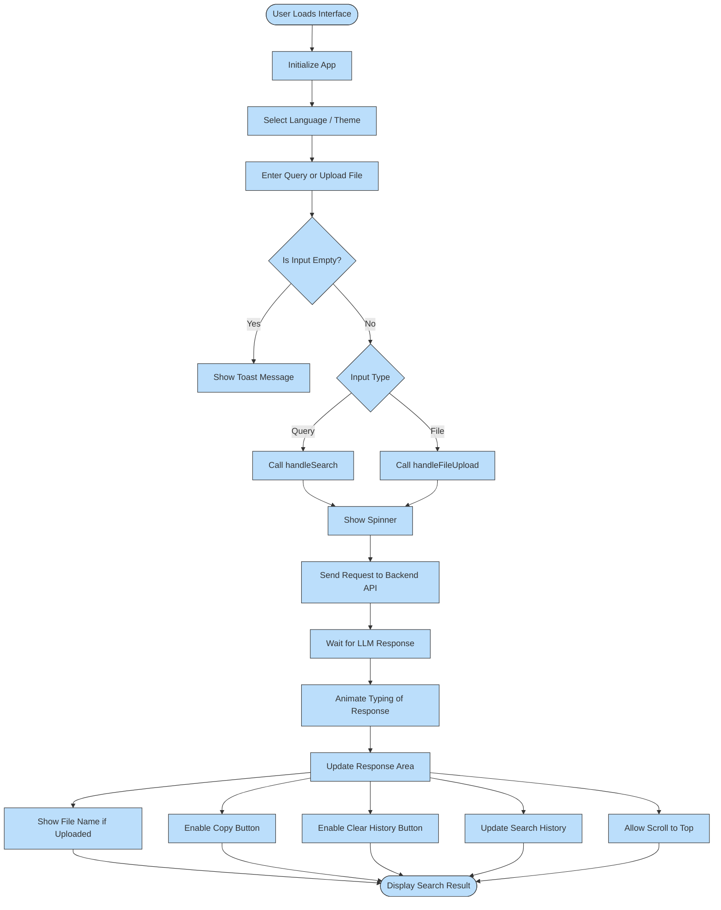

## 🖥️ Implementation of React Frontend

To complement the backend system, the **frontend of NeuroDoc** was developed using **React**, providing a modern, fast, and user-friendly interface. It allows users to search and explore enterprise documents through a clean and responsive interface.

The frontend communicates directly with the OpenSearch backend through structured queries, and it dynamically displays results with highlights, metadata, and smart UI interactions. The interface also supports multilingual options, theme switching, and advanced filtering for an enhanced user experience.

---

### 🔧 Core Capabilities

- **Multilingual UI**: supports English, Arabic (with RTL layout), and Polish, with automatic language detection and manual selection.
- **Live Interaction**: search results are updated dynamically based on user queries.
- **Dynamic Filters**: optional filters include date ranges, content keywords, signature, and tags, all accessible via a collapsible panel.
- **Search History Tags**: recently searched queries are shown as clickable tags that can be reused or removed.
- **Dark Mode Toggle**: users can switch between light and dark themes with smooth transitions.
- **File Upload Placeholder**: includes a UI button for uploading documents (planned for future functionality).
---

### 🔄 Frontend Workflow

1. The user types a query in the floating input field.
2. When submitted, the query is sent to the backend API using a `fetch` request.
3. The frontend builds a structured request, including optional language and filter data.
4. The results from the backend are displayed using styled blocks showing titles, snippets, and metadata.
5. If no results are returned, a fallback message is shown to the user.
6. The query is stored in the search history and displayed as a tag.
7. A loading spinner appears during the request, and a toast message shows warnings like empty queries or errors.

---

---
